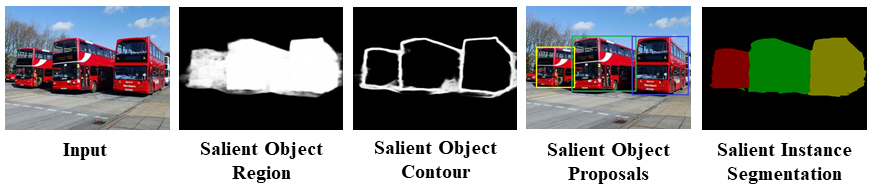

# MSRNet-CVIU
**Instance-Level Salient Object Segmentation** <br />
Guanbin Li, Pengxiang Yan, YuanXie, Guisheng Wang, Liang Lin, Yizhou Yu. <br />
Computer Vision and Image Understanding (CVIU), 2021, Elsevier. <br />
[[Paper](https://www.sciencedirect.com/science/article/pii/S1077314221000515)] <br />



## Salient Object Detection
### Links
* Predicted saliency maps: [[Google Drive](https://drive.google.com/file/d/1QrewZw6y2HKYKKGyRRzXbh-sw8485lyf/view?usp=sharing)]  [[Baidu Pan](https://pan.baidu.com/s/1TQiQ8E_pc1zPuW1bgwrGrA)](passwd: 9v58)
* Trained model weights: [[Google Drive](https://drive.google.com/file/d/1Df0PzdPoKsN7V1nN5NhOZVNf1OHfiUMW/view?usp=sharing)] [[Baidu Pan](https://pan.baidu.com/s/19AVQUL5yoVQoU5yTIYrNRA)] (passwd: 5zs3)
* Evaluation toolbox: [[sal_eval_toolbox](https://github.com/ArcherFMY/sal_eval_toolbox)]

### MSRNet-MXNet
This code `MSNet-MXNet` is tested on Ubuntu 16.04, Python=3.7 (via Anaconda3), MXNet=1.3.1, CUDA=9.2.
#### Install
```
# install MXNet (refer to your CUDA version)
$ pip install mxnet-cu92==1.3.1
# install others
$ pip install mxboard pyyaml tqdm opencv-python Pillow
```
Clone this repository with submodules:
```
git clone --recurse-submodules https://github.com/Kinpzz/MSRNet-CVIU.git
```
#### Training
```
# Training on DUTS-TR for salient object/region detection
$ python train.py --config config/MSRNet_DUTS.yaml
```
#### Inference
Download and save model weights in `MSRNet-MXNet/models`.
```
# Inference on DUTS-TE for salient object/region detection
# modify the config file to inference on other datasets
$ python test.py --config config/MSRNet_DUTS.yaml
```

## Salient Instance Segmentation
### Links
* Proposed Datasets (ILSO) [[Google Drive](https://drive.google.com/file/d/1tM_7IlDcQkqWB44kcZluJuiPd-Dnnw8k/view?usp=sharing)] [[Baidu Pan](https://pan.baidu.com/s/1O6ueVp2VZKRONxy0iboMzg)] (passwd: 159u)
  * ILSO-1K (CVPR 2017): training (1400), testing (600)
  * ILSO-2K (CVIU 2021): training (700), testing (300)
* Predicted salient region/contour/instance maps: [[Google Drive](https://drive.google.com/file/d/1ktkXU8bN4yOVV-xpVADjEQ-XGy8s0olr/view?usp=sharing)] [[Baidu Pan](https://pan.baidu.com/s/1O9TIupFpu9jEcJmpxBoAVg)] (passwd: gsqv)
* Evaluation toolbox: \[[salient instance segmentation](https://github.com/Kinpzz/MSRNet-CVIU/tree/main/instance_evaluation/)] \[[edge detection](https://www2.eecs.berkeley.edu/Research/Projects/CS/vision/bsds/)]

### Demo
Run ``instance_seg/demo.m`` in MATLAB.
Note that the salient region maps & salient contour maps are predicted by the above-mentioned MSRNet-MXNet fine-tuned on ILSO datasets.

## Citation
If you find this work helpful, please consider citing
```
# CVIU 2021
@article{li2021instance,
  title = {Instance-level salient object segmentation},
  author = {Li, Guanbin and Yan, Pengxiang and Xie, Yuan and Wang, Guisheng and Lin, Liang and Yu, Yizhou},
  journal = {Computer Vision and Image Understanding},
  volume = {207},
  pages = {103207},
  year = {2021},
  issn = {1077-3142},
}
# CVPR 2017
@inproceedings{li2017instance,
  title={Instance-level salient object segmentation},
  author={Li, Guanbin and Xie, Yuan and Lin, Liang and Yu, Yizhou},
  booktitle={Proceedings of the IEEE Conference on Computer Vision and Pattern Recognition},
  pages={2386--2395},
  year={2017}
}
```
